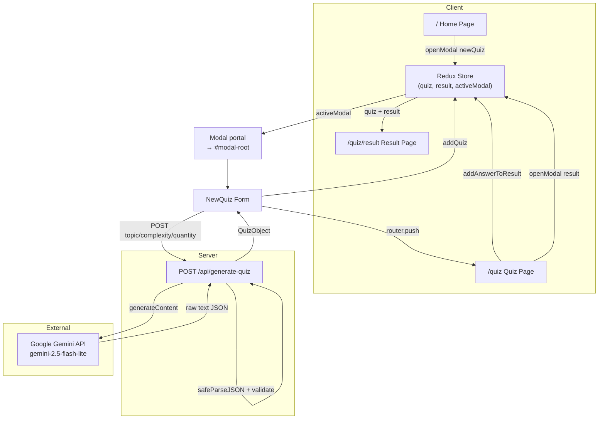
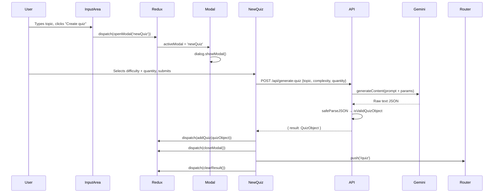
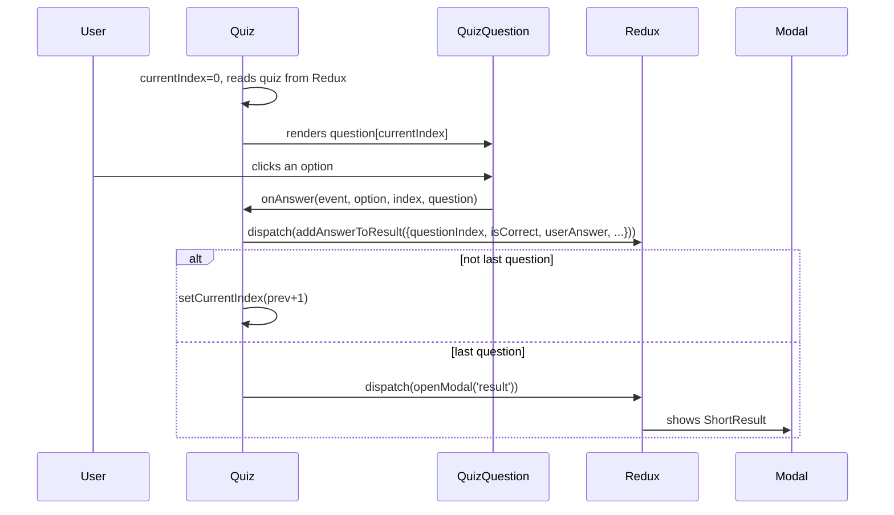
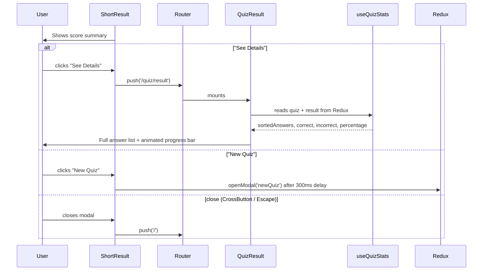

# QuickQuiz Codebase Map

> Auto-generated by Cartographer. Last mapped: 2026-05-14T18:13:29Z

## System Overview

QuickQuiz is a Next.js 15 (App Router) application that generates AI-powered quizzes via the Google Gemini API. Users provide a topic, difficulty, and question count; the server calls Gemini to produce a structured JSON quiz; Redux holds quiz and answer state in-memory (no persistence — refresh resets all state).



## Data Flow

### Quiz Creation Flow



### Answering Questions Flow



### Viewing Results Flow



## Directory Structure

```
app/                          Next.js App Router pages and API routes
  api/generate-quiz/          Gemini API integration (route handler + prompt)
    route.js                  POST handler — calls Gemini, validates response
    prompt.js                 System prompt enforcing strict JSON output
  layout.js                   Root layout with Redux provider, modal portal
  providers.js                Client-side Redux provider wrapper
  page.js                     Home page (Server Component)
  globals.css                 Global styles and design tokens
  quiz/
    page.js                   Quiz-taking page (Client Component, single/all view)
    page.module.css
    result/
      page.js                 Full results view (Client Component)
      page.module.css
components/
  header/                     Site header with conditional GetStartedButton
    header/
      header.js
      header.module.css
    get-started-button/
      get-started-button.js
      get-started-button.module.css
    nav-link/                 Unused active-state-aware link component
      nav-link.js
      nav-link.module.css
  home/                       Home page form components
    input-area/
      input-area.js           Topic input form + submit button
      input-area.module.css
  quiz/                       Quiz interaction components
    new-quiz/
      new-quiz.js             Modal form for quiz config (topic/difficulty/quantity)
      new-quiz.module.css
    quiz-question/
      quiz-question.js        Single question with option buttons
      quiz-question.module.css
  result/                     Results display components
    progress-bar/
      progress-bar.js         Animated circular score visualization
      progress-bar.module.css
      progress-provider.js    Render-prop animation wrapper
    result-header/
      result-header.js        Score summary + motivational message
      result-header.module.css
    short-result/
      short-result.js         Modal result summary (See Details / New Quiz buttons)
      short-result.module.css
  footer/                     Site footer
    footer.js
    footer.module.css
  ui/                         Reusable UI components
    button/
      button.js               Primary styled button with optional arrow icon
      button.module.css
    dark-button/
      dark-button.js          Secondary button (uses children prop)
      dark-button.module.css
    cross-button/
      cross-button.js         Icon-only close button
      cross-button.module.css
    modal/
      modal.js                Redux-controlled native <dialog> via React portal
      modal.module.css
    status-message/
      status-message.js       Error/warning display for form feedback
      status-message.module.css
store/
  store.js                    Redux store configuration
  quizSlice.js                Single Redux slice with all application state
hooks/
  useQuizStats.js             Derived state selector (correct, incorrect, percentage)
util/
  validation.js               Parsers and validators (safeParseJSON, isValidQuizObject, etc.)
  getCurrentYear.js           Utility for footer copyright year
__tests__/                    Jest tests mirroring source structure
  components/                 Component tests
  hooks/                      Hook tests
  pages/                      Page integration tests
  store/                      Redux reducer tests
  util/                       Validation and utility tests
__mocks__/
  fileMock.js                 Static asset mock for Jest
  next/image.js               Next.js Image mock
docs/
  CODEBASE_MAP.md             This file
```

## State Management

### Redux Slice (`store/quizSlice.js`)

**State shape:**
```javascript
{
  quiz: {},                     // { title: string, questions: [{ question, options: [4], answer, explanation }] }
  result: [],                   // [{ questionIndex, isCorrect, userAnswer, ...question }]
  activeModal: null             // 'newQuiz' | 'result' | null — only one modal open at a time
}
```

**Action creators:**
- `addQuiz(quizObject)` — fully replaces `quiz` state (overwrites any existing quiz)
- `clearQuiz()` — empties `quiz` (exported but never called in application flow)
- `addAnswerToResult(answerObject)` — appends to `result` array (guarded against duplicates by `questionIndex`)
- `clearResult()` — empties `result` array (called after new quiz loads to avoid state bleed)
- `openModal('newQuiz' | 'result')` — sets `activeModal` (no type safety; any string is accepted)
- `closeModal()` — sets `activeModal` to `null`

### State Lifecycle

```
1. User submits topic → dispatch openModal('newQuiz')
2. User submits form → NewQuiz calls POST /api/generate-quiz
3. Response arrives → dispatch addQuiz(quizData) → navigate to /quiz
4. Close modal → dispatch closeModal()
5. User answers Q1 → dispatch addAnswerToResult({questionIndex: 0, ...})
6. ... answer each question ...
7. Last question answered → dispatch openModal('result')
8. User chooses "New Quiz" → dispatch closeModal()
9. User submits new form → dispatch addQuiz(newQuiz) AND dispatch clearResult()
```

**Gotchas:**
- No persistence: page refresh loses all state. Guard effects on `/quiz` and `/quiz/result` redirect to `/`.
- `clearResult()` fires **after** `router.push('/quiz')` — brief window where old `result` coexists with new `quiz`.
- `clearQuiz()` action exists but is never dispatched — next quiz simply overwrites via `addQuiz()`.
- Modal type names are strings with no validation — a typo silently produces no effect.

## Module Guide

### API Route: `app/api/generate-quiz/route.js`

**Purpose:** Server-only route handler; POST endpoint that calls Google Gemini and returns validated quiz JSON.

**Exports:** `POST` (named export, Next.js App Router convention)

**Request:** `{ topic: string, complexity: string, quantity: number }`
**Response:** `{ result: QuizObject }` or `{ error: string }`

**Key behaviors:**
- Caps `quantity` at 20 server-side (prevents oversized responses)
- Uses `gemini-2.5-flash-lite` model via `@google/genai` SDK
- Pipes response through `safeParseJSON()` and `isValidQuizObject()` for strict validation
- Returns HTTP 500 if validation fails (no retry mechanism — user must resubmit)

**Dependencies:** `@google/genai`, local `./prompt`, `@/util/validation`

**Gotchas:**
- `GEMINI_API_KEY` is read at module init time — missing key causes silent build-time failure, not clear runtime error
- `maxOutputTokens: 1200` is very tight; >14 questions risk truncated JSON → parse failure → 500 error
- `responseMimeType: 'text/plain'` even though JSON is expected — parsing is handled by `safeParseJSON` regex fallback
- `temperature` is randomized via `getRandomTemperature()` — identical inputs produce non-deterministic results (intentional for variety)
- Non-numeric `quantity` values pass the `> 20` check silently (e.g., `"500"` coerces to number)
- `openai` package is listed as dependency but never used (dead code)

### API Prompt: `app/api/generate-quiz/prompt.js`

**Purpose:** System-level instruction string enforced in every Gemini call; defines JSON schema and question count.

**Exports:** `prompt` (string constant)

**Key instruction:** "Shuffle the questions array" — questions arrive in random order, so `questionIndex` in the result array is positional (0-based in shuffled order), not semantic.

**Gotcha:** The prompt warns against markdown/extra text, but `responseMimeType` is `'text/plain'` — `safeParseJSON` uses a regex to extract the first JSON object as a fallback if the response wraps the JSON.

### Pages

| Route | File | Type | Purpose | Guard |
|---|---|---|---|---|
| `/` | `app/page.js` | Server | Home page with hero + InputArea form | None |
| `/quiz` | `app/quiz/page.js` | Client | Main quiz-taking page (animated/all-at-once toggle) | Redirects to `/` if `quiz` empty |
| `/quiz/result` | `app/quiz/result/page.js` | Client | Full result detail with score breakdown | Redirects to `/` if both `result` and `quiz` empty |

**Layout:** `app/layout.js` is the root Server Component providing Redux context via `ClientProvider` (a client-side wrapper), persistent `Header`/`Footer`, and the `#modal-root` portal target.

**Gotchas on routes:**
- Guard in `/quiz` checks `Object.keys(quiz).length > 0` (number) as a boolean — variable named `isQuiz` is misleading
- Guard in `/quiz/result` allows arrival with only `quiz` loaded (no answers yet) — page renders empty
- No `clearQuiz` / `clearResult` dispatch on route exit — state persists for the full session
- Result page hides summary when `activeModal === 'newQuiz'` but remains visible when `activeModal === 'result'` (modal stays "open" in Redux after navigating away)

### Components: Header & Navigation

**`components/header/header.js`**
- Persistent site header with logo link
- Conditionally renders `GetStartedButton` only on `/` via `usePathname()`
- Imports but does not use `NavLink` component (dead code)

**`components/header/get-started-button/get-started-button.js`**
- Dispatches `openModal('newQuiz')` on click
- Does not render the Modal itself — relies on a sibling `Modal` component listening for `'newQuiz'`
- If rendered on a page without a listening Modal, state is set but nothing visual happens

**`components/header/nav-link/nav-link.js`**
- Active-state-aware navigation link using `usePathname()`
- **Not used anywhere in the codebase** — orphaned component
- `startsWith` check means a `/quiz` link would also activate for `/quiz/result`

### Components: Home & Form

**`components/home/input-area/input-area.js`**
- Home page form collecting topic text
- Controlled input locally; passes `userInput` as `topic` prop to `NewQuiz` modal
- `NewQuiz` treats `topic` as `defaultValue` (uncontrolled), so edits in the modal don't flow back to `InputArea`
- Modal is always in DOM (via portal), only becomes visible when `activeModal === 'newQuiz'`
- Header's `GetStartedButton` also opens `newQuiz` modal but passes no topic — field starts empty

**`components/quiz/new-quiz/new-quiz.js`**
- Main quiz configuration form (topic, difficulty, quantity)
- Uses `AbortController` with manual 25-second timeout for fetch cancellation
- Mixes controlled/uncontrolled inputs: preset quantity radios are controlled, free-form number input is also controlled; clicking the number field sets `checked: false` on both presets, leaving no selection
- **Multiple `<input name="quantity">` elements** — FormData picks the last one with a value (fragile ordering assumption)
- `setPending()` is called after request regardless of success/failure
- `useEffect` clears error AND aborts in-flight request when `activeModal` changes — closing the modal mid-request cancels fetch
- `topic` validation runs on submit only; checks `trim().length < 2` but error message says "two syllables" (misleading)
- `clearResult()` is dispatched in `handleSubmit` after `router.push()` completes — stale result data briefly exists during navigation

**Constants:**
- `LONG_RESPONSE_THRESHOLD = 14` — shows warning for >14 questions
- `TIMEOUT_MS = 25000` — AbortController timeout
- `DIFFICULTY_LEVELS = ['novice', 'medium', 'difficult', 'expert']`

### Components: Quiz & Questions

**`components/quiz/quiz-question/quiz-question.js`**
- Renders a single quiz question with option buttons
- Local `userOption` state initialized from `selectedOption` prop at mount
- `useState` ignores prop changes after mount — in "show all" view, if a question is re-rendered with different `selectedOption`, the displayed selection becomes stale
- "Next/Finish" button submits `'No answer provided.'` hardcoded string for skipped questions
- `isDisabled` only blocks clicks (early return), not HTML `disabled` attribute — keyboard navigation still works visually

**`app/quiz/page.js`**
- Single-question carousel with animated slide transitions, plus all-questions scrollable list mode
- Uses `CSSTransition` from `react-transition-group` with `nodeRefs` for stable refs (avoids React 18 `findDOMNode` deprecation)
- Dual-view toggle via local `showAll` state
- `finishQuiz()` fills unanswered questions by calling `handleAnswer(null, ...)` — the `null` event is specially handled to skip side effects
- `openNewQuiz` uses 300ms `setTimeout` before `openModal('newQuiz')` — timing hack to avoid close/open flash
- Guard effect redirects to `/` if `!isQuiz` (where `isQuiz = Object.keys(quiz).length > 0`)
- Missing `router` from dependency array (not practical bug since router is stable)

### Components: Results & Progress

**`components/result/short-result/short-result.js`**
- Modal-based result summary shown immediately after quiz completion
- Delegates score display to `ResultHeader`
- "See Details" navigates to `/quiz/result` without closing modal — modal stays "open" in Redux state
- "New Quiz" opens `newQuiz` modal after 300ms delay
- Close button navigates to `/` and closes modal

**`components/result/result-header/result-header.js`**
- Score breakdown with animated progress circle, correct/incorrect counts, motivational message
- Tiers: <50% → "Keep going!", 50–80% → "Nice! Almost there...", >80% → "Great job!"
- Initial state hardcoded to middle message — brief flash of wrong message on first render if score is <50% or >80%
- Threshold at 80% is exclusive (`> 80`), so exactly 80% gets middle message
- Close button navigates to `/`

**`components/result/progress-bar/progress-bar.js`**
- Circular progress bar visualization using `react-circular-progressbar`
- Imports `d3-ease` (`easeQuadInOut`) but does not use it
- Passes `easingFunction` to `ProgressProvider` but `ProgressProvider` ignores it
- Actual animation comes from `CircularProgressbar`'s CSS `pathTransitionDuration: 1`

**`components/result/progress-bar/progress-provider.js`**
- Render-prop pattern (children-as-function) that animates value from `valueStart` to `valueEnd`
- `easingFunction` prop is accepted but never used — transition is instantaneous state update
- `valueStart` is used only for initial render — changing it after mount has no effect

### UI Components

**`components/ui/button/button.js`**
- Primary button with optional arrow icon
- Renders `title` prop as `<span>` child (not HTML `title` attribute) — no tooltip
- No `aria-label` fallback
- Spreads remaining props (`type`, `disabled`, `onClick`, etc.)

**`components/ui/dark-button/dark-button.js`**
- Secondary button using `children` prop (unlike `Button` which uses `title`)
- Inconsistent API pattern with `Button`

**`components/ui/cross-button/cross-button.js`**
- Close icon button using SVG image
- No `aria-label` — screen readers only get image `alt` text ("cross symbol")

**`components/ui/modal/modal.js`**
- Redux-controlled native `<dialog>` element rendered via `createPortal()` into `#modal-root`
- `showModal()` / `close()` controlled by `useEffect` reacting to `activeModal` Redux state
- `modalRoot` initialized in `useEffect` to avoid SSR mismatch
- Pressing Escape fires `onClose` event; if `modalType === 'result'`, also navigates to `/`
- Multiple `Modal` instances with same `modalType` can coexist and both call `.showModal()` (native dialog "already open" error in dev)
- Modal renders nothing on server and on first client render before `useEffect` fires

**`components/ui/status-message/status-message.js`**
- Error/warning display for form feedback
- `type === 'error'` applies error styles; any other value defaults to warning styles

### Utilities

**`util/validation.js`**

| Export | Purpose |
|--------|---------|
| `isQuantityValid(input)` | Returns `true` if `0 < +input && +input <= 20`; coerces to number |
| `safeParseJSON(jsonString, quantity)` | Normalizes whitespace, extracts first `{...}` via regex, parses JSON, validates with `isValidQuizObject` |
| `isValidQuizObject(obj, questionsQuantity)` | Checks `title` is string, exact `questions.length === questionsQuantity`, all required fields per question |
| `getRandomTemperature()` | Returns one of `[0.6, 0.9, 1.1]` at random for API calls |

**Gotchas:**
- `isValidQuizObject` enforces exact length match — if Gemini returns one fewer question, entire response rejected → 500 error
- `safeParseJSON` regex `/{.*}/s` extracts first `{...}` — nested braces could extract incomplete fragment
- `getRandomTemperature` is exported from validation.js but conceptually belongs with API utilities (cohesion issue)

**`util/getCurrentYear.js`**
- Simple utility returning current calendar year
- Called at render time in `Footer` (Server Component) — runs server-side at request time (correct, no hydration mismatch)

**`__mocks__/fileMock.js`**
- Jest mock for static assets; returns empty string
- Configured in `jest.config.cjs` via moduleNameMapper

### Configuration

**`jsconfig.json`**
- Single path alias: `@/*` maps to `./*` (project root)
- Used throughout for absolute imports (`@/store/quizSlice`, `@/util/validation`, etc.)

**`next.config.mjs`**
- Minimal config
- Only custom setting: `experimental.forceSwcTransforms: true` — ensures SWC compiler used in test environment

**`package.json` anomalies:**
- `openai` — installed but never imported in source (dead dependency)
- `@heroui/react`, `@heroui/progress` — installed but not visibly used (possibly used in CSS or unmapped pages)
- `react-move` — installed but not used (ProgressProvider does not use it despite easing prop pattern)
- `redux-mock-store` — in `dependencies` instead of `devDependencies` (misclassified)
- `babel-plugin-styled-components` — in `dependencies` but no styled-components usage visible

## Testing

**Jest configuration:** `jest.config.cjs` (CommonJS required because `package.json` is `"type": "module"`)

**Setup:** `jest.setup.js` imports `@testing-library/jest-dom` matchers

**Test patterns:**
- Redux slice tests use real reducer (not mocked store)
- Hook tests use `renderHook` + real `configureStore` with preloaded state + `Provider` wrapper
- CSS Modules mocked via `identity-obj-proxy`
- Static assets mocked via `fileMock.js`

**Test structure:**
```
__tests__/
  components/
    footer/footer.test.js
    header/get-started-button.test.js, header.test.js
    home/input-area.test.js
    quiz/new-quiz/new-quiz.test.js, quiz-question.test.js
    result/progress-bar.test.js, result-header.test.js, short-result.test.js
    ui/button.test.js, cross-button.test.js, dark-button.test.js, modal.test.js, status-message.test.js
  hooks/useQuizStats.test.js
  pages/quiz-result.page.test.js, quiz.page.test.js
  store/quizSlice.test.js
  util/getRandomTemperature.test.js, isQuantityValid.test.js, isValidQuizObject.test.js, safeParseJSON.test.js
```

## Conventions

- **Component directories:** Each component owns `<name>.js` + `<name>.module.css` in `components/<domain>/<name>/`
- **Path alias:** `@/` resolves to project root (configured in `jsconfig.json`)
- **Client boundary:** `'use client'` only where hooks or browser APIs are used; Server Components remain so
- **CSS custom properties:** Full design token palette on `:root` in `globals.css`; component modules reference these tokens
- **Modal system:** Controlled entirely by `activeModal` in Redux. Multiple `Modal` instances listen to the same state.

## Critical Gotchas

| # | Location | Issue | Impact |
|---|----------|-------|--------|
| 1 | `app/api/generate-quiz/route.js` | `maxOutputTokens: 1200` may truncate large quizzes | >14 questions risk JSON truncation → 500 error |
| 2 | `app/api/generate-quiz/route.js` | `GEMINI_API_KEY` read at module init | Missing env var causes silent build-time failure |
| 3 | `store/quizSlice.js` | No persistence — refresh loses all state | State guard effects on `/quiz` and `/quiz/result` redirect to `/` |
| 4 | `store/quizSlice.js` | `activeModal` accepts any string, no validation | Typo in modal name silently produces no effect |
| 5 | `components/ui/modal/modal.js` | Escape key on `'result'` modal navigates to `/` | User expects close; instead lands on home page |
| 6 | `components/result/progress-bar/progress-provider.js` | `easingFunction` prop accepted but ignored | Prop is dead API; actual animation via CSS transition |
| 7 | `components/quiz/new-quiz/new-quiz.js` | Multiple `<input name="quantity">` in FormData | Fragile ordering assumption; last input with value wins |
| 8 | `components/quiz/new-quiz/new-quiz.js` | `clearResult()` called after `router.push()` | Brief window where old result coexists with new quiz |
| 9 | `components/quiz/quiz-question/quiz-question.js` | `useState` ignores prop changes after mount | In "show all" mode, stale selection if question re-renders |
| 10 | `components/quiz/quiz-question/quiz-question.js` | "No answer provided." hardcoded in two places | String value couples component and page logic |
| 11 | `components/header/nav-link/nav-link.js` | Component exists but unused | Dead code in repository |
| 12 | `app/quiz/page.js` | `isQuiz` variable name misleading (is number, not boolean) | Fragile if `quiz` structure changes from object to array |
| 13 | `app/quiz/result/page.js` | Page renders if only `quiz` loaded, no `result` | Empty answer list with no error message |
| 14 | `components/result/result-header/result-header.js` | Initial `cheerUpMessage` hardcoded to middle tier | Brief flash of wrong message on first render |
| 15 | `util/validation.js` | `isValidQuizObject` enforces exact `questions.length` match | Off-by-one from Gemini rejects entire response |
| 16 | `app/globals.css` | `.quiz-wrapper` and `.question-box` CSS classes have no JSX consumers | Dead CSS rules |
| 17 | `package.json` | `openai`, `@heroui/react`, `@heroui/progress` installed but unused | Dead dependencies |

## Navigation Guide

**To change the AI model or system prompt:**
- Edit `app/api/generate-quiz/route.js` (model selection, parameters)
- Edit `app/api/generate-quiz/prompt.js` (system instruction)

**To adjust question limits:**
- Change `LONG_RESPONSE_THRESHOLD` in `components/quiz/new-quiz/new-quiz.js` (warning threshold)
- Change `maxOutputTokens` in `app/api/generate-quiz/route.js` (API limit)
- Change `isQuantityValid(input)` in `util/validation.js` (min/max validation)

**To add a new difficulty level:**
- Add to `DIFFICULTY_LEVELS` array in `components/quiz/new-quiz/new-quiz.js`

**To add a new page:**
- Create `app/<route>/page.js`
- If it requires quiz state, add a guard effect to redirect to `/` when state is empty

**To add a new modal type:**
- Add string constant (e.g., `'feedback'`)
- Dispatch `openModal('feedback')` where needed
- Add a `<Modal modalType='feedback'>...</Modal>` instance in the component tree
- Dispatch `closeModal()` when done

**To add a new Redux action:**
- Add a reducer to `store/quizSlice.js` and export the action creator

**To add derived quiz stats:**
- Extend `hooks/useQuizStats.js` with additional selectors

**To modify API validation:**
- Edit `util/validation.js` (`safeParseJSON`, `isValidQuizObject`)
- Edit response validation in `app/api/generate-quiz/route.js`

**To customize modal styling:**
- Edit `components/ui/modal/modal.module.css`
- The modal uses native `<dialog>` element (limited CSS customization due to `::backdrop` pseudo-element)

**To add tests:**
- Create test file in `__tests__/` mirroring source structure (e.g., `__tests__/components/my-component/my-component.test.js`)
- Import component and render with appropriate wrappers (Redux provider for connected components, etc.)
- Use `@testing-library/react` and `@testing-library/jest-dom` matchers
